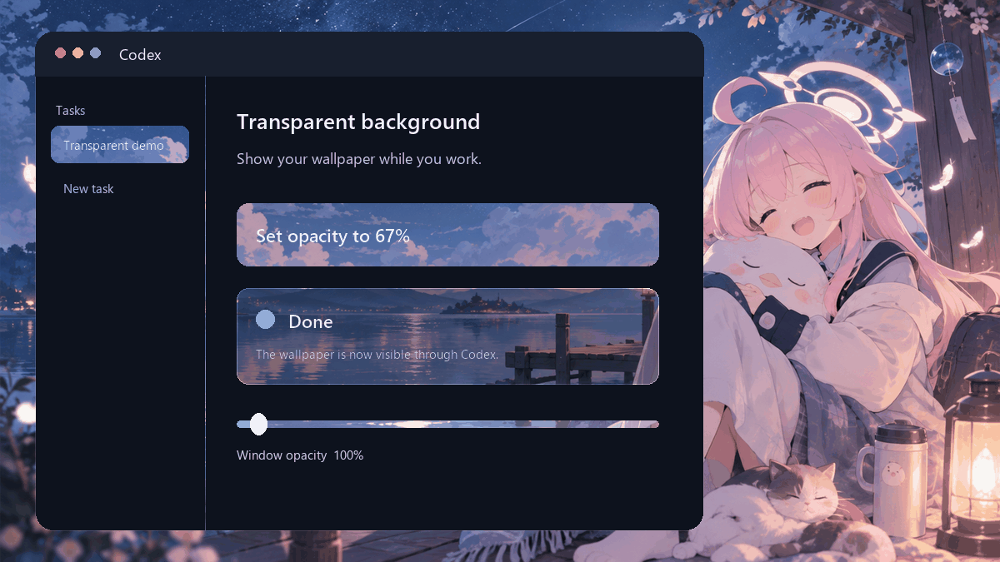

# Codex Transparent Background



A small Windows-only Codex plugin that changes the opacity of the entire Codex desktop window, letting your wallpaper remain visible while you work.

> [!IMPORTANT]
> This changes **whole-window opacity**, including text and controls. It does not patch Codex files, inject CSS, or provide acrylic/background-only transparency.

## Requirements

- Windows 10 or Windows 11
- The packaged Codex desktop app (`OpenAI.Codex_*\app\ChatGPT.exe`)
- PowerShell 7 (`pwsh`) recommended; Windows PowerShell 5.1 is also supported by the runtime
- Codex CLI available on `PATH` for automatic plugin registration

## Install from the v1.0.0 release

Paste this single command into PowerShell:

```powershell
$d=Join-Path ([IO.Path]::GetTempPath()) ('codex-opacity-'+[guid]::NewGuid());$z="$d.zip";iwr 'https://github.com/fishapple/codex-transparent-bg/releases/download/v1.0.0/codex-window-opacity-v1.0.0.zip' -OutFile $z;Expand-Archive $z -DestinationPath $d;& "$d/install.ps1";Remove-Item $z -Force;Remove-Item $d -Recurse -Force
```

Start a new Codex task after installation. Codex may ask you to trust the bundled `SessionStart` hook; approve it only after reviewing [`hooks/hooks.json`](hooks/hooks.json) and [`scripts/Set-CodexWindowOpacity.ps1`](scripts/Set-CodexWindowOpacity.ps1).

## Install from source

```powershell
git clone https://github.com/fishapple/codex-transparent-bg.git
cd codex-transparent-bg
pwsh -ExecutionPolicy Bypass -File .\install.ps1
```

The installer copies only the plugin folders into your personal marketplace, preserves unrelated marketplace entries, and registers `codex-window-opacity@personal` when the Codex CLI is available.

## Use

Ask Codex naturally:

```text
Set the Codex window to 75% opacity and save it.
Make Codex a little more transparent.
Restore the Codex window to fully opaque.
```

Or run the installed script directly:

```powershell
$script="$HOME\.agents\plugins\plugins\codex-window-opacity\scripts\Set-CodexWindowOpacity.ps1"
pwsh -File $script -Opacity 75 -Save
pwsh -File $script -Restore -Save
pwsh -File $script -Diagnostic
```

Supported opacity values are `35` through `100`. The default is `90`; a saved value is reapplied when a new Codex session starts.

## Uninstall

From a clone or extracted release:

```powershell
pwsh -ExecutionPolicy Bypass -File .\uninstall.ps1
```

The uninstaller first attempts to restore full opacity, then removes only this plugin and its marketplace entry. Add `-KeepSettings` to retain the saved opacity preference.

## Security and privacy

- The runtime enumerates visible top-level windows and targets only `ChatGPT.exe` inside an `OpenAI.Codex_` packaged-app path.
- It uses documented User32 window-style and layered-window APIs; it never modifies Codex installation files.
- Settings contain only the chosen opacity percentage and live under `%LOCALAPPDATA%\CodexWindowOpacity\settings.json`.
- The demo uses a generated wallpaper and a fully synthetic interface. It contains no real screenshots, account details, local paths, or user content.

## Limitations and troubleshooting

- This plugin currently supports Windows only.
- Opacity applies to the whole window, so lower values also fade text and controls. Values below `35` are rejected for usability.
- If no Codex window is found, confirm you are using the packaged Codex desktop app and run with `-Diagnostic`.
- If the CLI was unavailable during installation, run `codex plugin add codex-window-opacity@personal` later.
- If a saved value is not applied, open a new Codex task so the `SessionStart` hook can run.

## Artwork notice

The demo wallpaper is original fan art generated for this project. Takanashi Hoshino and Blue Archive are properties of their respective rights holders. This project is unofficial, non-commercial, and is not affiliated with or endorsed by those rights holders or OpenAI.

Project code is released under the [MIT License](LICENSE). Character names and designs are not granted under that license.

中文说明见 [README.zh-CN.md](README.zh-CN.md)。
